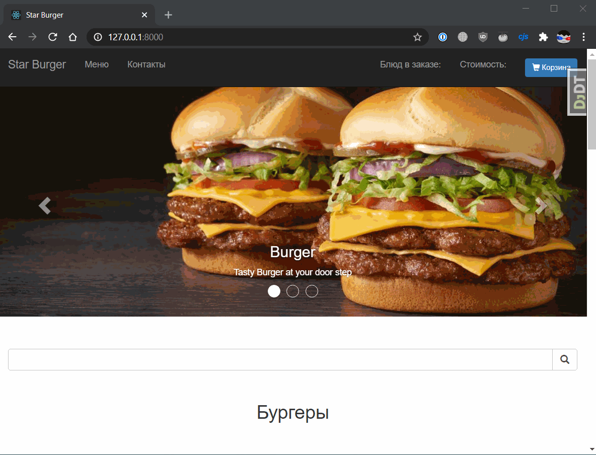

# Сайт доставки еды Star Burger

Это сайт сети ресторанов Star Burger. Здесь можно заказать превосходные бургеры с доставкой на дом.

[Рабочая версия сайта](https://burger-star.ru/)




Сеть Star Burger объединяет несколько ресторанов, действующих под единой франшизой. У всех ресторанов одинаковое меню и одинаковые цены. Просто выберите блюдо из меню на сайте и укажите место доставки. Мы сами найдём ближайший к вам ресторан, всё приготовим и привезём.

На сайте есть три независимых интерфейса. Первый — это публичная часть, где можно выбрать блюда из меню, и быстро оформить заказ без регистрации и SMS.

Второй интерфейс предназначен для менеджера. Здесь происходит обработка заказов. Менеджер видит поступившие новые заказы и первым делом созванивается с клиентом, чтобы подтвердить заказ. После оператор выбирает ближайший ресторан и передаёт туда заказ на исполнение. Там всё приготовят и сами доставят еду клиенту.

Третий интерфейс — это админка. Преимущественно им пользуются программисты при разработке сайта. Также сюда заходит менеджер, чтобы обновить меню ресторанов Star Burger.

## Как запустить dev-версию сайта

Для запуска сайта нужно запустить **одновременно** бэкенд и фронтенд, в двух терминалах.

### Как собрать бэкенд

Скачайте код:
```sh
git clone https://github.com/devmanorg/star-burger.git
```

Перейдите в каталог проекта:
```sh
cd star-burger
```

[Установите Python](https://www.python.org/), если этого ещё не сделали.

Проверьте, что `python` установлен и корректно настроен. Запустите его в командной строке:
```sh
python --version
```
**Важно!** Версия Python должна быть не ниже 3.6.

Возможно, вместо команды `python` здесь и в остальных инструкциях этого README придётся использовать `python3`. Зависит это от операционной системы и от того, установлен ли у вас Python старой второй версии. 

В каталоге проекта создайте виртуальное окружение:
```sh
python -m venv venv
```
Активируйте его. На разных операционных системах это делается разными командами:

- Windows: `.\venv\Scripts\activate`
- MacOS/Linux: `source venv/bin/activate`


Установите зависимости в виртуальное окружение:
```sh
pip install -r requirements.txt
```

Определите переменные окружения. Создайте файл `.env` в корне проекта и добавьте туда следующие настройки:

```sh
SECRET_KEY=
DEBUG=
ALLOWED_HOSTS=
YANDEX_GEOCODER_API_KEY=
DATABASE_URL=
```

Для работы системы логирования ошибок Rollbar добавьте следующие переменные в файл `.env`:
```sh
ROLLBAR_ACCESS_TOKEN=
ROLLBAR_ENVIRONMENT=
ROLLBAR_BRANCH=
```

### Установка PostgreSQL

1. **Установите PostgreSQL** с официального сайта: https://www.postgresql.org/download/

2. **Создайте базу данных и пользователя**:
```sql
-- Подключитесь к PostgreSQL как пользователь postgres
psql -U postgres

-- Создание пользователя
CREATE USER star_burger_user WITH PASSWORD 'star_burger_password';

-- Создание базы данных
CREATE DATABASE star_burger_db OWNER star_burger_user;

-- Предоставление прав
GRANT ALL PRIVILEGES ON DATABASE star_burger_db TO star_burger_user;

-- Подключение к новой базе данных
\c star_burger_db

-- Предоставление прав на схему
GRANT ALL ON SCHEMA public TO star_burger_user;
```

Примените миграции к базе данных:

```sh
python manage.py migrate
```

Запустите сервер:

```sh
python manage.py runserver
```

Откройте сайт в браузере по адресу [http://127.0.0.1:8000/](http://127.0.0.1:8000/). Если вы увидели пустую белую страницу, то не пугайтесь, выдохните. Просто фронтенд пока ещё не собран. Переходите к следующему разделу README.

### Собрать фронтенд

**Откройте новый терминал**. Для работы сайта в dev-режиме необходима одновременная работа сразу двух программ `runserver` и `parcel`. Каждая требует себе отдельного терминала. Чтобы не выключать `runserver` откройте для фронтенда новый терминал и все нижеследующие инструкции выполняйте там.

[Установите Node.js](https://nodejs.org/en/), если у вас его ещё нет.

Проверьте, что Node.js и его пакетный менеджер корректно установлены. Если всё исправно, то терминал выведет их версии:

```sh
nodejs --version
# v16.16.0
# Если ошибка, попробуйте node:
node --version
# v16.16.0

npm --version
# 8.11.0
```

Версия `nodejs` должна быть не младше `10.0` и не старше `16.16`. Лучше ставьте `16.16.0`, её мы тестировали. Версия `npm` не важна. Как обновить Node.js читайте в статье: [How to Update Node.js](https://phoenixnap.com/kb/update-node-js-version).

Перейдите в каталог проекта и установите пакеты Node.js:

```sh
cd star-burger
npm ci --dev
```

Команда `npm ci` создаст каталог `node_modules` и установит туда пакеты Node.js. Получится аналог виртуального окружения как для Python, но для Node.js.

Помимо прочего будет установлен [Parcel](https://parceljs.org/) — это упаковщик веб-приложений, похожий на [Webpack](https://webpack.js.org/). В отличии от Webpack он прост в использовании и совсем не требует настроек.

Теперь запустите сборку фронтенда и не выключайте. Parcel будет работать в фоне и следить за изменениями в JS-коде:

```sh
./node_modules/.bin/parcel watch bundles-src/index.js --dist-dir bundles --public-url="./"
```

Если вы на Windows, то вам нужна та же команда, только с другими слешами в путях:

```sh
.\node_modules\.bin\parcel watch bundles-src/index.js --dist-dir bundles --public-url="./"
```

Дождитесь завершения первичной сборки. Это вполне может занять 10 и более секунд. О готовности вы узнаете по сообщению в консоли:

```
✨  Built in 10.89s
```

Parcel будет следить за файлами в каталоге `bundles-src`. Сначала он прочитает содержимое `index.js` и узнает какие другие файлы он импортирует. Затем Parcel перейдёт в каждый из этих подключенных файлов и узнает что импортируют они. И так далее, пока не закончатся файлы. В итоге Parcel получит полный список зависимостей. Дальше он соберёт все эти сотни мелких файлов в большие бандлы `bundles/index.js` и `bundles/index.css`. Они полностью самодостаточны, и потому пригодны для запуска в браузере. Именно эти бандлы сервер отправит клиенту.

Теперь если зайти на страницу  [http://127.0.0.1:8000/](http://127.0.0.1:8000/), то вместо пустой страницы вы увидите:


Каталог `bundles` в репозитории особенный — туда Parcel складывает результаты своей работы. Эта директория предназначена исключительно для результатов сборки фронтенда и потому исключёна из репозитория с помощью `.gitignore`.

**Сбросьте кэш браузера <kbd>Ctrl-F5</kbd>.** Браузер при любой возможности старается кэшировать файлы статики: CSS, картинки и js-код. Порой это приводит к странному поведению сайта, когда код уже давно изменился, но браузер этого не замечает и продолжает использовать старую закэшированную версию. В норме Parcel решает эту проблему самостоятельно. Он следит за пересборкой фронтенда и предупреждает JS-код в браузере о необходимости подтянуть свежий код. Но если вдруг что-то у вас идёт не так, то начните ремонт со сброса браузерного кэша, жмите <kbd>Ctrl-F5</kbd>.


## Как запустить prod-версию сайта

### Краткая инструкция по деплою

1. **Подготовка сервера**: Установить Python 3.6+, Node.js 16.x, PostgreSQL, Nginx
2. **Настройка проекта**: Скопировать код, установить зависимости, собрать фронтенд
3. **База данных**: Создать пользователя и базу данных PostgreSQL
4. **Окружение**: Создать файл `star_burger/.env` с настройками
5. **Сервисы**: Настроить systemd сервисы и Nginx
6. **SSL**: Установить сертификаты Let's Encrypt
7. **Автоматизация**: Настроить автоматическое обновление

**Автоматический деплой**: Используйте скрипт `deploy_star_burger.sh` для быстрого обновления кода.

Подробная инструкция по деплою находится в файле [`deployment_instructions.md`](deployment_instructions.md).

## Архитектура проекта

### Технологический стек

**Бэкенд:**
- Django 5.2 — веб-фреймворк
- SQLite/PostgreSQL — база данных
- Django REST Framework — API
- Geopy — расчет расстояний
- Yandex Geocoder API — геокодирование адресов

**Фронтенд:**
- React.js — пользовательский интерфейс
- Parcel — сборщик модулей
- Bootstrap — CSS-фреймворк

### Поток данных

**Главная страница сайта:**
1. Пользователь вводит URL в браузере
2. Браузер отправляет HTTP-запрос на сервер Django
3. Django по URL-маршруту находит соответствующий view
4. View обращается к БД за данными (товары, баннеры)
5. Django рендерит HTML-шаблон с данными
6. Готовый HTML отправляется в браузер пользователя

**Оформление заказа:**
1. Клиент выбирает товары в корзине (фронтенд React.js)
2. Заполняет форму с контактными данными и адресом
3. JavaScript отправляет POST-запрос на Django API (`/api/order/`)
4. Django валидирует данные (проверка телефона, обязательных полей)
5. Создается запись в таблице `Order` в БД
6. Для каждого товара создается запись в `OrderItem`
7. Django возвращает JSON-ответ с результатом операции
8. Фронтенд показывает уведомление об успешном заказе

**Обработка заказа менеджером:**
1. Менеджер заходит в панель управления (`/manager/`)
2. Django проверяет права доступа (аутентификация)
3. View загружает заказы из БД с помощью ORM
4. Для каждого заказа система рассчитывает расстояния до ресторанов
5. Используется кэш геокодера для ускорения расчетов
6. Менеджер видит список заказов с расстояниями
7. Для каждого заказа показана ссылка "Редактировать" в админку Django
8. В админке менеджер уточняет данные после звонка клиенту
9. Менеджер меняет статус заказа, добавляет комментарии, выбирает ресторан
10. Данные сохраняются в БД и менеджер возвращается к списку заказов

**Работа с Яндекс Геокодером:**
1. **Первый запрос к адресу:**
   - Django проверяет кэш в таблице `GeocoderCache`
   - Если адреса нет в кэше, отправляется запрос к API Яндекса
   - Параметры: API-ключ, адрес, формат JSON
   - Яндекс возвращает координаты (широта, долгота)
   - Результат сохраняется в БД с датой запроса

2. **Повторный запрос к тому же адресу:**
   - Django находит адрес в кэше
   - Возвращает координаты из БД без обращения к API
   - Время ответа сокращается с 200-500мс до 1-2мс
   - Старые данные используются, если API недоступен

3. **Расчет расстояний:**
   - Для каждого ресторана вычисляется расстояние до адреса доставки
   - Используется библиотека Geopy (формула гаверсинуса)
   - Результаты сортируются по расстоянию
   - Менеджер видит ближайшие рестораны первыми

**Валидация данных:**
- **Фронтенд:** JavaScript проверяет формат телефона, заполненность полей
- **API:** Django валидирует данные через сериализаторы
- **БД:** Ограничения на уровне модели (уникальность, обязательные поля)
- **Геокодер:** Проверка корректности адреса, обработка ошибок API

## Цели проекта

Код написан в учебных целях — это урок в курсе по Python и веб-разработке на сайте [Devman](https://dvmn.org). За основу был взят код проекта [FoodCart](https://github.com/Saibharath79/FoodCart).

Где используется репозиторий:

- Второй и третий урок [учебного курса Django](https://dvmn.org/modules/django/)
